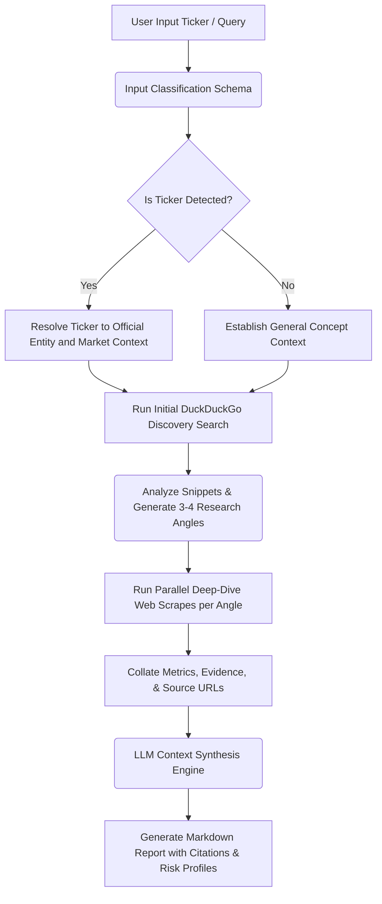

# 🔍 Deep Research Intelligence Agent

An advanced, multi-step AI research agent built with Python, Pydantic, and Gradio. The agent automatically detects whether an input is a public stock ticker or a general query, plans an optimized investigation strategy, conducts parallel deep-dive web searches via DuckDuckGo, and synthesizes an authoritative analytical market brief with grounded citations.

---

## ✨ Features

- **🤖 Intelligent Input Classification** – Automatically differentiates between financial stock tickers (e.g., `NVDA`, `AAPL`) and general concepts to adjust its analytical framework dynamically.
- **🗺️ Automated Search Angle Formulation** – Analyzes initial discovery snippets to map out 3–4 distinct, non-overlapping investigation pathways for comprehensive coverage.
- **🕵️ Parallel Web Intelligence Scraper** – Orchestrates multiple parallel deep-dive queries against DuckDuckGo to extract hard facts, real-time news, and metrics.
- **🛡️ Pydantic-Validated Pipelines** – Uses strict type-safe Pydantic structures to manage classifications, research strategies, data payloads, and finalized reports.
- **📊 Institutional-Grade Synthesis** – Output includes an Executive Summary, core findings per research vector, risk profiling, and forward-looking catalysts to watch.
- **🔗 Grounded Citations Registry** – Tracks every source used across threads and embeds an explicit markdown link registry mapping specific claims back to original URLs.

---

## 🛠️ Prerequisites

- Python 3.9 or higher
- OpenRouter API key (Get a free key at [openrouter.ai](https://openrouter.ai))

---

## 🚀 Quick Start

### 1. Position and Setup Project

Ensure you are inside your project directory:

```bash
cd Pydantic

```

### 2. Activate Virtual Environment

**Windows:**

```bash
python -m venv venv
venv\Scripts\activate

```

**macOS/Linux:**

```bash
python3 -m venv venv
source venv/bin/activate

```

### 3. Install Required Frameworks

```bash
pip install -r requirements.txt

```

### 4. Configure Environment Variables

Create or open your `.env` file in the root directory and append your credentials.

> 💡 **Recommendation:** Deep data synthesis requires models optimized for processing complex multi-source logic. It is highly recommended to use a capable free tier model like Google's Gemma.

```ini
# OpenRouter API Credentials
OPENROUTER_API_KEY=sk-or-your-actual-key-here

# Target LLM Engine Model Configuration
OPENROUTER_MODEL=google/gemma-7b-it:free

```

---

## 💻 Usage

### Run the Web UI (Gradio)

Launch the browser interface to run real-time deep research briefs:

```bash
python app.py

```

Open your browser and navigate to: `http://localhost:7860`

### Run Command Line Diagnostic Test

Execute a quick automated diagnostic pipeline using the core terminal test module:

```bash
python agent.py

```

---

## 🗂️ Project Architecture

```text
Pydantic/
├── app.py              # Gradio web interface and reactive markdown layouts
├── agent.py            # Strategic orchestration logic, scrapers, and Pydantic schemas
├── requirements.txt    # Application runtime dependencies
├── .env                # Local secrets configuration file (Do Not Commit)
├── .gitignore          # Repository exclusions configuration
└── README.md           # System documentation brief

```

---

## ⚙️ How the Engine Works



1. **Classification Vector:** Parses input using `InputClassification` Pydantic models to identify financial asset anchors or standard structural topics.
2. **Discovery & Scrape Plan:** Runs broad queries against `html.duckduckgo.com` to review real-time landing page texts and automatically structures non-overlapping investigation targets via a `ResearchAngles` schema.
3. **Deep Harvesting:** Hits the web on parallel trajectories to build out a centralized intelligence matrix containing titles, URLs, and contextual data blocks.
4. **Contextual Assembly:** Filters out noise, matches assertions directly to underlying data, tracks data gaps, and structures an exhaustive analytical document.

---

## 🛡️ Data Validation Schemas

### `InputClassification`

- `is_ticker` (bool): True if targeting financial tracking symbols.
- `resolved_name` (str): Full corporate designation or cleanly expanded theme text.
- `context` (str): Targeted industry space or key macro variables.

### `ResearchAngles`

- `angles` (List[str]): List of 3 to 4 distinct keywords or search phrases to expand investigation.

### `DeepResearchReport`

- `executive_summary` (str): High-level market intelligence summary.
- `sections` (Dict[str, str]): Named granular analytics sections aligned to individual search angles.
- `evidence_and_citations` (List[str]): Verified data assertions linked to source URLs.
- `risks_and_uncertainties` (str): Diverging source arguments, anomalies, and structural threats.
- `what_to_watch_for` (List[str]): Forward catalysts, earnings calls, or industry trigger markers.

---

## ⚠️ Troubleshooting

- **File Tracking Errors (Unignored `.env`):** If changes to your `.env` file continue to be caught by Git status, clear the system caching layout manually by running: `git rm -r --cached .` followed by `git add .` to enforce the `.gitignore` rules safely.
- **Empty Response Payload Errors:** Free-tier endpoints may occasionally throttle traffic or timeout under heavy loads. If a request errors out, switch your `OPENROUTER_MODEL` variable inside `.env` to alternative stable configurations like `meta-llama/llama-3-8b-instruct:free`.
- **Port Conflicts:** If port 7860 is bound to an alternate runtime instance on your machine, open `app.py` and modify the `server_port=7860` value under the launch block to an open port (e.g., `server_port=7861`).

---

## 📄 License

Distributed under the MIT License. See `LICENSE` for more information.
